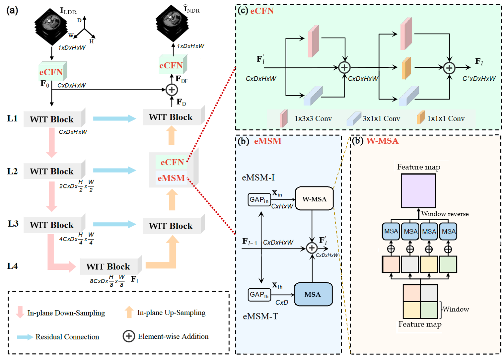

# WIT-Former: Window In-plane and Through-plane Transformers for Simultaneous CT Image Denoising on 2.5D data
This is the official implementation of the WIT-Former


## Updates
Mar, 2025: initial commit.  

## Approach


## Data Preparation

 
#### Dataset structre:


## Requirements
```
- Linux Platform
- cuda==12.4 # depends on the CUDA version of your machine
- Python==3.12.7
```

## Traning and & Inference
Training
```
python train.py --is_train --dataroot (path to dataset) --checkpoints_dir checkpoints(path to save model checkpoint)  --name litformer(name of project)  --train_batch_size 64 --phase train --is_val  --gpu_ids 0,1
```

Inference & testing
```
python test.py --is_test --dataroot (path to dataset)   --name litformer(name of project)   --model_path  (path to load model checkpoint) --phase test --test_batch_size 1  --gpu_ids 0
```
Please refer to options files for more setting.


## Citations
Tis model is a combination between LIt-Former and windoe attention from Uformer. Citations:

```
@article{chen2024lit,
  title={LIT-Former: Linking in-plane and through-plane transformers for simultaneous CT image denoising and deblurring},
  author={Chen, Zhihao and Niu, Chuang and Gao, Qi and Wang, Ge and Shan, Hongming},
  journal={IEEE Transactions on Medical Imaging},
  year={2024},
  publisher={IEEE}
}
```
```
@InProceedings{Wang_2022_CVPR,
    author    = {Wang, Zhendong and Cun, Xiaodong and Bao, Jianmin and Zhou, Wengang and Liu, Jianzhuang and Li, Houqiang},
    title     = {Uformer: A General U-Shaped Transformer for Image Restoration},
    booktitle = {Proceedings of the IEEE/CVF Conference on Computer Vision and Pattern Recognition (CVPR)},
    month     = {June},
    year      = {2022},
    pages     = {17683-17693}
}

```

